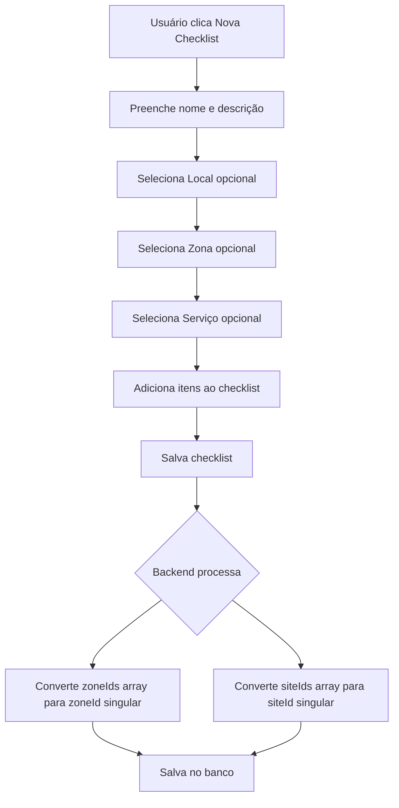
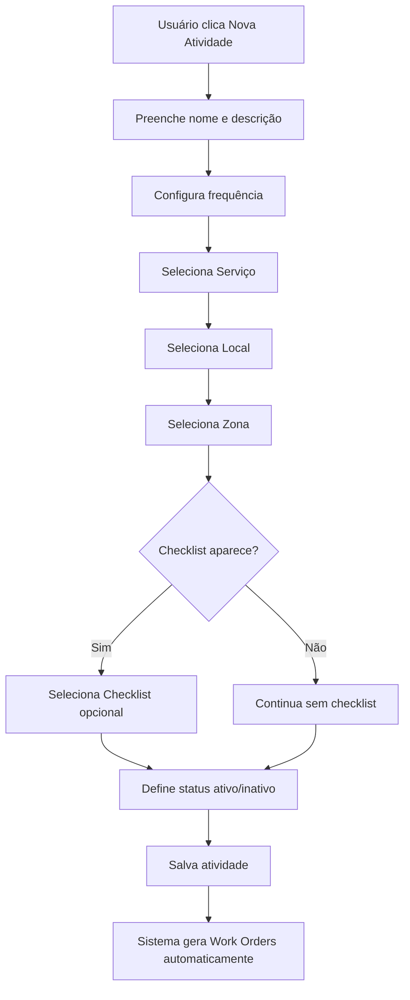
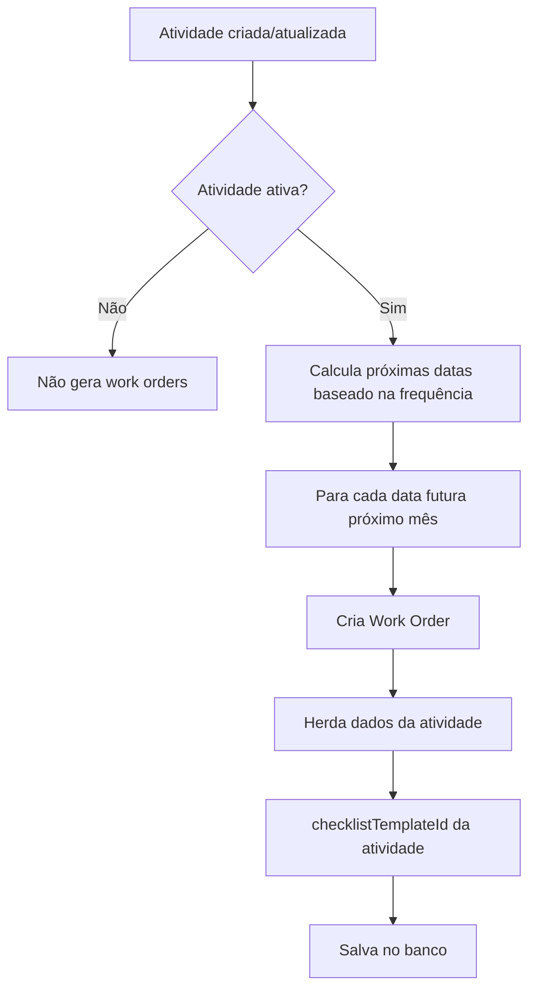
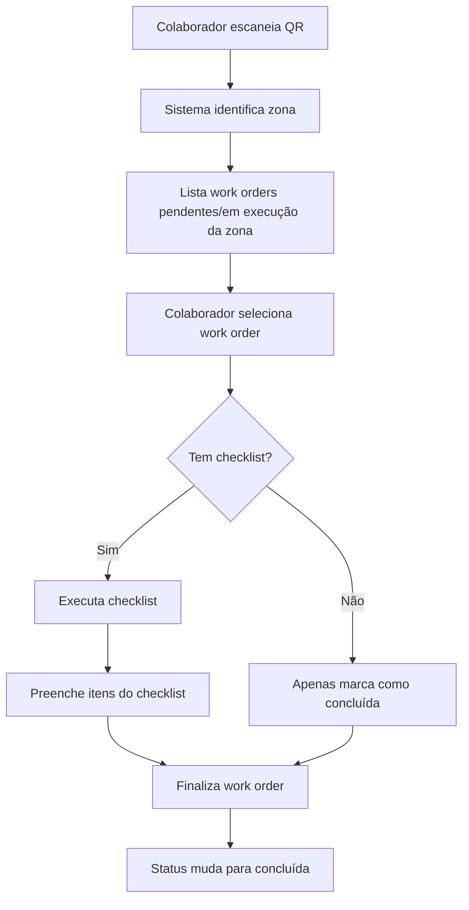
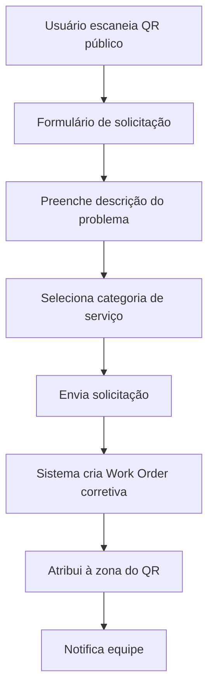
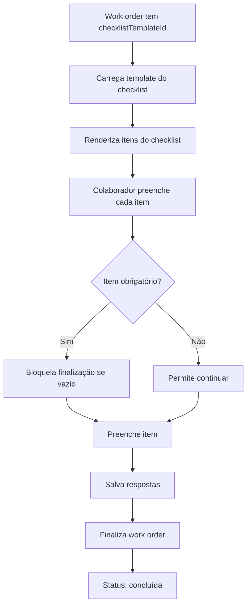
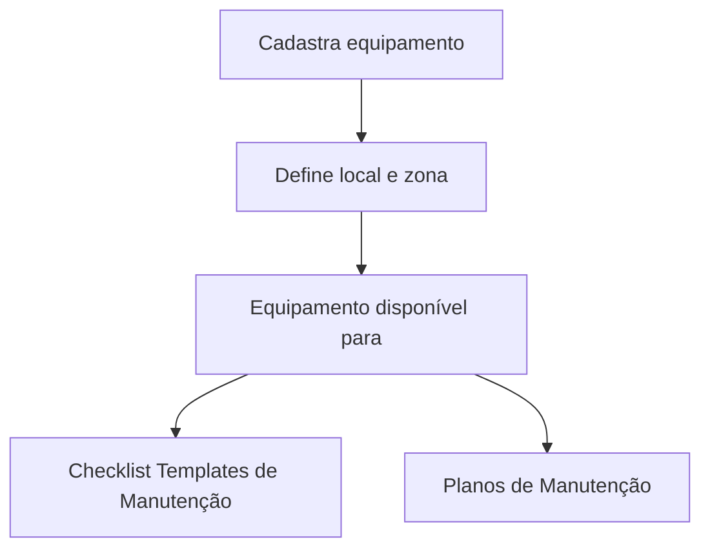
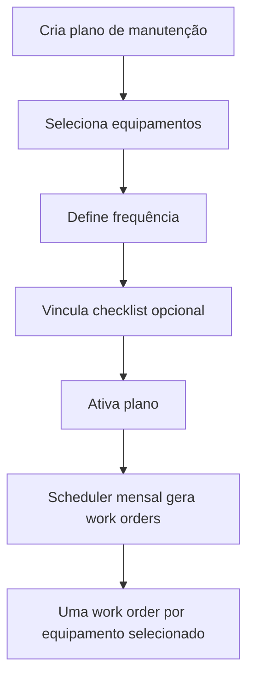

# OPUS - Documentação de Fluxo do Sistema

**Data de Atualização**: 06/11/2025

---

## 📋 Índice

1. [Visão Geral](#visão-geral)
2. [Arquitetura de Dados](#arquitetura-de-dados)
3. [Fluxo de Checklists](#fluxo-de-checklists)
4. [Fluxo de Atividades de Limpeza](#fluxo-de-atividades-de-limpeza)
5. [Fluxo de Work Orders](#fluxo-de-work-orders)
6. [Fluxo Mobile - QR Code](#fluxo-mobile---qr-code)
7. [Fluxo de Manutenção](#fluxo-de-manutenção)

---

## 🎯 Visão Geral

O OPUS é uma plataforma modular de gestão de facilities com dois módulos principais:

- **OPUS Clean**: Gestão de limpeza e facilities
- **OPUS Manutenção**: Gestão de manutenção preventiva e corretiva

### Hierarquia Multi-Tenant

```
Companies (Empresas)
  └── Customers (Clientes)
      └── Sites (Locais)
          └── Zones (Zonas)
              └── Work Orders (Ordens de Serviço)
```

---

## 🗄️ Arquitetura de Dados

### Principais Entidades

#### 1. **Companies** (Empresas)
- Nível mais alto da hierarquia
- Gerencia múltiplos clientes
- Campos principais: `id`, `name`

#### 2. **Customers** (Clientes)
- Pertence a uma empresa
- Possui módulos ativos (`modules: ['clean', 'maintenance']`)
- Campos principais: `id`, `name`, `companyId`, `modules`

#### 3. **Sites** (Locais)
- Pertence a um cliente
- Específico de módulo (`module: 'clean' | 'maintenance'`)
- Campos principais: `id`, `name`, `customerId`, `module`

#### 4. **Zones** (Zonas)
- Pertence a um local
- Representa áreas específicas dentro do local
- Campos principais: `id`, `name`, `siteId`

#### 5. **Services** (Serviços)
- Tipos de serviço prestados
- Específico de módulo
- Campos principais: `id`, `name`, `module`, `customerId`

#### 6. **Checklist Templates** (Templates de Checklist)
- Modelos de checklist reutilizáveis
- Podem ser vinculados a serviço, local e zona específicos
- Campos principais: `id`, `name`, `module`, `serviceId`, `siteId`, `zoneId`, `items`

---

## ✅ Fluxo de Checklists

### 1. Criação de Checklist Template

**Página**: `/checklists`

**Processo**:



**Vinculação de Checklists**:

- **Genérico**: Sem serviço/local/zona → aparece para TODOS
- **Específico**: Com serviço/local/zona → aparece apenas quando há match exato

**Exemplo de Dados**:

```json
{
  "name": "Checklist Limpeza Completa",
  "module": "clean",
  "serviceId": "service-123",  // Específico para esse serviço
  "siteId": "site-456",         // Específico para esse local
  "zoneId": "zone-789",         // Específico para essa zona
  "items": [
    {
      "id": "1",
      "type": "checkbox",
      "label": "Limpar piso",
      "required": true
    },
    {
      "id": "2",
      "type": "text",
      "label": "Observações",
      "required": false
    }
  ]
}
```

---

## 🔄 Fluxo de Atividades de Limpeza

### 1. Criação de Atividade de Limpeza

**Página**: `/cleaning-schedule`

**Processo**:



**Filtros de Checklist**:

O checklist aparece no dropdown APENAS se:

```javascript
✅ module === 'clean'
✅ (!serviceId OU serviceId === formData.serviceId)
✅ (!siteId OU siteId === formData.siteId)
✅ (!zoneId OU zoneId === formData.zoneId)
```

**Configuração de Frequência**:

- **Diária**: Gera work orders todos os dias
- **Semanal**: Escolhe dias da semana
- **Por Turno**: Escolhe turnos (manhã, tarde, noite)
- **Mensal**: Escolhe dia do mês
- **Trimestral**: Escolhe mês e dia
- **Semestral**: Escolhe mês e dia
- **Anual**: Escolhe mês e dia

**Exemplo de Atividade**:

```json
{
  "name": "Limpeza Completa - Recepção",
  "frequency": "weekly",
  "frequencyConfig": {
    "weekDays": [1, 3, 5]  // Segunda, Quarta, Sexta
  },
  "serviceId": "service-limpeza",
  "siteId": "site-predio-a",
  "zoneId": "zone-recepcao",
  "checklistTemplateId": "checklist-limpeza-completa",
  "isActive": true
}
```

---

## 📝 Fluxo de Work Orders

### 1. Geração Automática de Work Orders

**Trigger**: Quando uma atividade é criada ou no scheduler mensal

**Processo**:



**Dados Herdados da Atividade**:

- `serviceId`: Serviço da atividade
- `zoneId`: Zona da atividade
- `checklistTemplateId`: Checklist vinculado à atividade
- `priority`: Prioridade padrão (normal)
- `type`: Tipo "programada"
- `module`: Módulo da atividade

**Exemplo de Work Order Gerada**:

```json
{
  "number": 1224,
  "title": "Limpeza Completa - Recepção",
  "serviceId": "service-limpeza",
  "zoneId": "zone-recepcao",
  "checklistTemplateId": "checklist-limpeza-completa",
  "status": "pendente",
  "priority": "normal",
  "type": "programada",
  "module": "clean",
  "dueDate": "2025-11-10T10:00:00Z"
}
```

### 2. Scheduler Mensal

**Quando**: Último dia do mês às 23:00

**O que faz**: Gera work orders para o próximo mês de TODAS as atividades ativas

---

## 📱 Fluxo Mobile - QR Code

### 1. Tipos de QR Codes

#### A) **Execution QR** (Equipe Interna)

**Uso**: Colaboradores escaneiam para ver e executar work orders

**Processo**:



**Filtros na Seleção**:

```javascript
✅ zoneId === QR zoneId
✅ module === active module
✅ status IN ['pendente', 'em_execucao']
```

#### B) **Public QR** (Usuários Finais)

**Uso**: Qualquer pessoa escaneia para solicitar serviço

**Processo**:



### 2. Execução de Checklist no Mobile

**Página**: `/mobile/work-order/:id`

**Processo**:



**Tipos de Itens de Checklist**:

- `text`: Campo de texto livre
- `checkbox`: Checkbox simples
- `number`: Campo numérico
- `date`: Seletor de data
- `photo`: Upload de foto
- `signature`: Captura de assinatura

---

## 🔧 Fluxo de Manutenção

### 1. Equipamentos

**Página**: `/equipment`

**Processo**:



### 2. Planos de Manutenção

**Página**: `/maintenance-plans`

**Processo**:



---

## 🔐 Controle de Acesso e Módulos

### Filtros de Módulo

Todos os dados são isolados por módulo:

- Sites filtrados por `module`
- Zones filtradas por sites do módulo
- Services filtrados por `module`
- Checklists filtrados por `module`
- Work orders filtradas por `module`

### Permissões de Usuário

Cada usuário tem:
- `modules`: Array de módulos permitidos `['clean', 'maintenance']`
- Sidebar mostra apenas módulos permitidos
- Seletor de módulo aparece apenas se usuário tem 2+ módulos

---

## 📊 Resumo de Endpoints Principais

### Checklists
```
GET    /api/customers/:customerId/checklist-templates
POST   /api/customers/:customerId/checklist-templates
PUT    /api/customers/:customerId/checklist-templates/:id
DELETE /api/customers/:customerId/checklist-templates/:id
```

### Atividades de Limpeza
```
GET    /api/customers/:customerId/cleaning-activities
POST   /api/customers/:customerId/cleaning-activities
PUT    /api/customers/:customerId/cleaning-activities/:id
DELETE /api/customers/:customerId/cleaning-activities/:id
```

### Work Orders
```
GET    /api/customers/:customerId/work-orders
GET    /api/work-orders/:id
POST   /api/work-orders
PUT    /api/work-orders/:id
```

### QR Codes
```
GET    /api/customers/:customerId/qr-points
POST   /api/customers/:customerId/qr-points
```

---

## 🎨 Design System

### Cores de Módulo

- **OPUS Clean**: Azul (`#3B82F6`)
- **OPUS Manutenção**: Laranja (`#F97316`)

### Componentes Modernos

- `ModernCard`: Cards com variantes (default, gradient, glass, featured)
- `ModernPageHeader`: Cabeçalho de página padronizado
- `ModernCardContent`: Conteúdo de card moderno

### Tema Visual

- Background predominantemente branco
- Gradientes sutis para profundidade
- Glassmorphism em cards destacados
- Cores de módulo apenas em elementos focais (badges, botões primários)

---

## 📝 Notas Importantes

### Backend - Conversão de Arrays

O frontend envia `zoneIds` e `siteIds` como arrays, mas o backend converte para singular:

```javascript
const { zoneIds, siteIds, ...restBody } = req.body;
const checklistData = { 
  ...restBody, 
  zoneId: zoneIds?.[0] || null,
  siteId: siteIds?.[0] || null
};
```

### Scheduler

O sistema possui um scheduler que roda no último dia do mês às 23:00 para gerar work orders do próximo mês.

### Mobile Dashboard

Colaboradores veem um indicador visual especial de work orders em execução no topo do dashboard mobile.

---

**Fim da Documentação de Fluxo**
